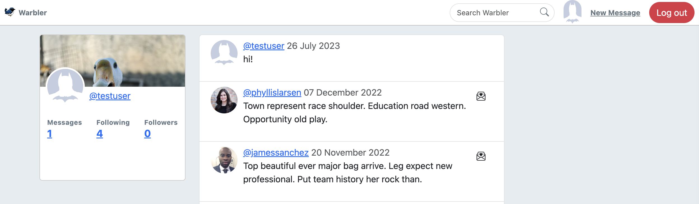
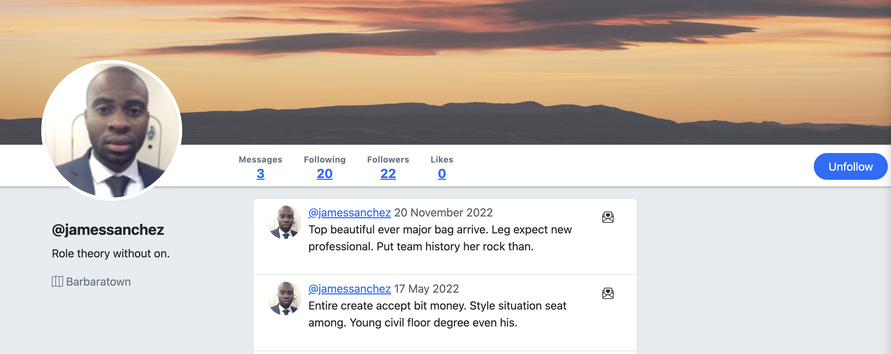
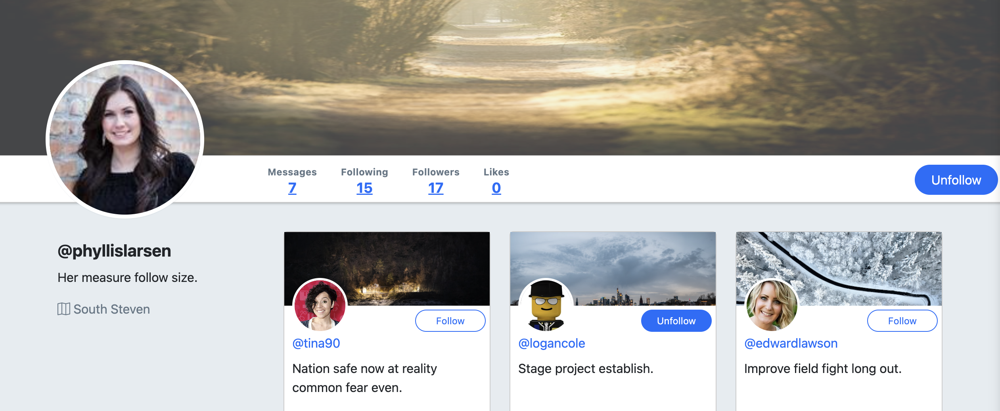

<a name="readme-top"></a>
<div align="center">
<a href="https://warbler-huse.onrender.com/">
    
</a>

<h1 align="center">Warbler</h1>

  <p align="center">
    Social media...without the musk.
    <br />
    <br />
    <a href="https://warbler-huse.onrender.com/" target="_blank">View Demo ("guest" | "password")</a>
    ·
    <a href="https://github.com/husekivrak/warbler/issues">Report Bug</a>
    ·
    <a href="https://github.com/husekivrak/warbler/issues">Request Feature</a>
    <br />
  </p>
</div>

<div align="center">


</div>

<!-- TABLE OF CONTENTS -->
<details>
  <summary>Table of Contents</summary>
  <ol>
    <li>
      <a href="#about-the-project">About The Project</a>
      <ul>
        <li><a href="#screenshots">Screenshots</a></li>
        <li><a href="#features">Features</a></li>
        <li><a href="#built-with">Built With</a></li>
      </ul>
    </li>
    <li>
      <a href="#getting-started">Getting Started</a>
      <ul>
        <li><a href="#installation">Installation</a></li>
      </ul>
    </li>
    <li><a href="#contributing">Contributing</a></li>
    <li><a href="#license">License</a></li>
    <li><a href="#contact">Contact</a></li>
    <li><a href="#acknowledgments">Acknowledgments</a></li>
  </ol>
</details>


<!-- ABOUT THE PROJECT -->
## About the Project

Warbler is a Twitter ("X"?!) clone, complete with post, 'follow', and 'like' functionalities.

It's a server-side, full-stack web app built with Flask, Jinja, and PostgreSQL. The demo is hosted on [Render](https://render.com/) and the database is hosted on [ElephantSQL](https://www.elephantsql.com/).

### Screenshots

<p>
  
  <br>
  <em>Logged-In Timeline</em>
</p>

<p>
  
  <br>
  <em>User Profile Page</em>
</p>

<p>
  
  <br>
  <em>Followers Listing Page</em>
</p>

<p align="right">(<a href="#readme-top">back to top</a>)</p>

### Features

- Account creation and (session) authorization
- Profile updating, including adding or changing profile picture
- ~~Tweet~~ Warble creation, 'like'/'unlike', and deletion
- 'Follow'/'unfollow' functionality between users
- User timeline, with warbles from followed accounts + themselves
- User list views of 'followers', 'following', and all users
- List views for self-posted and liked warbles


<p align="right">(<a href="#readme-top">back to top</a>)</p>


### Built With

- ![Flask][Flask]
- ![Python][Python]
- ![Jinja][Jinja]
- ![SQLAlchemy][SQLAlchemy]
- ![PostgreSQL][PostgreSQL]
- ![WTForms][WTForms]
- ![Bcrypt][Bcrypt]
- ![Gunicorn][Gunicorn]
- ![Jquery][Jquery]
- ![Bootstrap][Bootstrap]

See [requirements.txt](https://github.com/huseKivrak/warbler/blob/main/requirements.txt) for a full list of dependencies.

<p align="right">(<a href="#readme-top">back to top</a>)</p>

<!-- GETTING STARTED -->
## Getting Started

Follow these quick steps for a local copy.
   > note: **[PostgreSQL](https://www.postgresql.org/download/)** required

### Installation

1. Clone the repo

   ```sh
   git clone https://github.com/husekivrak/warbler.git
   ```

2. Create and activate a virtual environment

    ```sh
    python3 -m venv venv
    source venv/bin/activate
    ```

3. Install dependencies

    ```sh
    pip3 install -r requirements.txt
    ```

4. Create database

    ```sh
    createdb warbler
    ```

5. Seed database

    ```sh
    python3 seed.py
    ```

6. Run the app

    ```sh
    flask run
    ```

<p align="right">(<a href="#Warbler">back to top</a>)</p>

<!-- CONTRIBUTING -->
## Contributing

1. Fork the Project [here](https://github.com/huseKivrak/warbler/fork)
2. Create your Feature Branch (`git checkout -b feature/NewFeature`)
3. Commit your Changes (`git commit -m 'Add some NewFeature'`)
4. Push to the Branch (`git push origin feature/NewFeature`)
5. Open a Pull Request

<p align="right">(<a href="#readme-top">back to top</a>)</p>

<!-- LICENSE -->
## License

Distributed under the MIT License. See [LICENSE.txt](https://github.com/husekivrak/warbler/blob/main/LICENSE.txt) for more information.

<p align="right">(<a href="#readme-top">back to top</a>)</p>

<!-- CONTACT -->
## Contact

Huse Kivrak - [huse@husekivrak.com](mailto:huse@husekivrak.com)

Project Link: [https://github.com/husekivrak/warbler](https://github.com/husekivrak/warbler)

Live Demo: [https://warbler-huse.onrender.com/](https://warbler-huse.onrender.com/)

<p align="right">(<a href="#readme-top">back to top</a>)</p>

<!-- ACKNOWLEDGMENTS -->
## Acknowledgments

Completed as part of the [Rithm School](https://www.rithmschool.com/) curriculum with co-creator [Will Squires](https://github.com/william-squires)

<p align="right">(<a href="#readme-top">back to top</a>)</p>


<!-- TECHNOLOGY BADGES -->

[Flask]: https://img.shields.io/badge/Flask-007D69?logo=flask&logoColor=white
[Gunicorn]: https://img.shields.io/badge/Gunicorn-492548?logo=gunicorn&logoColor=white
[Python]: https://img.shields.io/badge/Python-3776AB?logo=python&logoColor=white
[Bcrypt]: https://img.shields.io/badge/Bcrypt-FF5700?logo=bcrypt&logoColor=white
[Jinja]: https://img.shields.io/badge/Jinja-B41717?logo=jinja&logoColor=white
[PostgreSQL]: https://img.shields.io/badge/PostgreSQL-316192?logo=postgresql&logoColor=white
[WTForms]: https://img.shields.io/badge/WTForms-2D9CDB?logo=wtforms&logoColor=white
[SQLAlchemy]: https://img.shields.io/badge/SQLAlchemy-1C2833?logo=sqlalchemy&logoColor=white
[Bootstrap]: https://img.shields.io/badge/Bootstrap-563D7C?logo=bootstrap&logoColor=white
[jQuery]: https://img.shields.io/badge/jQuery-0769AD?logo=jquery&logoColor=white

